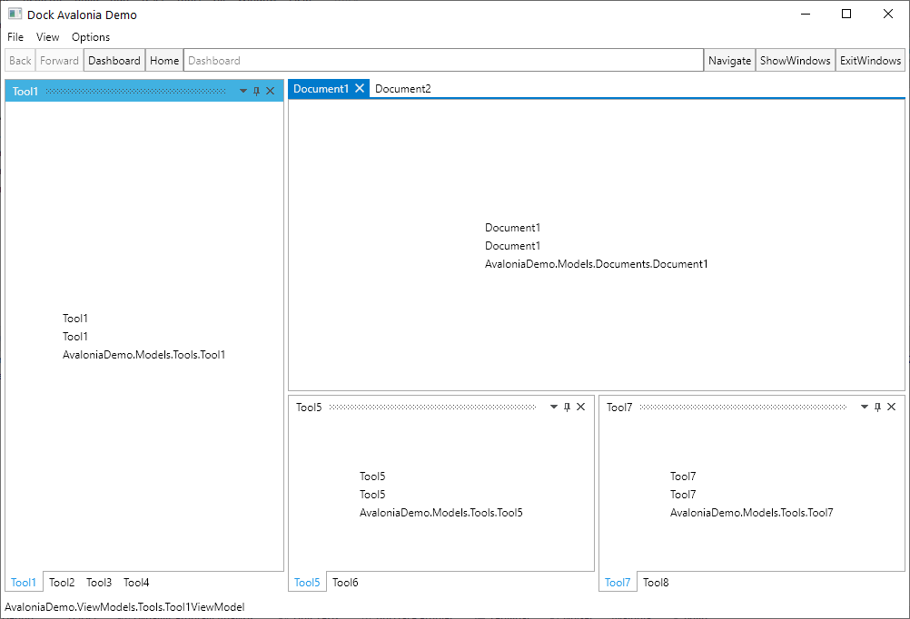

# Dock

[](https://gitter.im/wieslawsoltes/Dock?utm_source=badge&utm_medium=badge&utm_campaign=pr-badge)

[](https://dev.azure.com/wieslawsoltes/GitHub/_build/latest?definitionId=89&branchName=master)
[](https://github.com/wieslawsoltes/Dock/actions/workflows/build.yml)

[](https://www.nuget.org/packages/Dock.Avalonia)
[](https://www.nuget.org/packages/Dock.Avalonia)
[](https://www.myget.org/gallery/dock-nightly) 

A docking layout system.

## About

**Dock** is a docking layout system for [Avalonia](https://github.com/AvaloniaUI/Avalonia) applications. Use of Dock is governed by the MIT License.

**Key Features:**
- **ItemsSource Support**: Bind document collections directly to DocumentDock for automatic document management
- **Flexible Content Templates**: Use DocumentTemplate for customizable document content rendering
- **Optional Document Content Caching**: Keep document views alive across tab switches via theme option (`CacheDocumentTabContent`)
- **Multiple MVVM Frameworks**: Support for ReactiveUI, Prism, ReactiveProperty, and standard MVVM patterns
- **Comprehensive Serialization**: Save and restore layouts with multiple format options (JSON, XML, YAML, Protobuf)
- **Rich Theming**: Fluent and Simple themes with full customization support
- **Floating Windows**: Detach documents and tools into separate windows
- **Dependency Injection**: First-class support for .NET DI containers

[](images/Dock.png)

## Building Dock

First, clone the repository or download the latest zip.
```
git clone https://github.com/wieslawsoltes/Dock.git
```

### Build using .NET Core

Open up a terminal prompt and execute the commands.

Target frameworks: `netstandard2.0`, `net6.0`, `net8.0`, `net10.0` for libraries and samples:
```bash
dotnet build src/Dock.Avalonia/Dock.Avalonia.csproj -c Release -f netstandard2.0
```

Alternatively execute the repository build script which restores,
builds and tests all projects. The scripts work on Windows and Unix
like systems:

```bash
./build.sh       # or .\build.cmd on Windows
```

## NuGet

Dock is delivered as a NuGet package.

You can find the packages here [NuGet](https://www.nuget.org/packages/Dock.Avalonia/) and install the package like this:

```powershell
Install-Package Dock.Avalonia
Install-Package Dock.Model.Mvvm
Install-Package Dock.Serializer.Newtonsoft
Install-Package Dock.Avalonia.Themes.Fluent
Install-Package Dock.Avalonia.Themes.Browser
```

**Available NuGet packages:**

| NuGet | Package | Downloads |
| --- | --- | --- |
| [](https://www.nuget.org/packages/Dock.Avalonia) | [`Dock.Avalonia`](https://www.nuget.org/packages/Dock.Avalonia) | [](https://www.nuget.org/packages/Dock.Avalonia) |
| [](https://www.nuget.org/packages/Dock.Avalonia.Diagnostics) | [`Dock.Avalonia.Diagnostics`](https://www.nuget.org/packages/Dock.Avalonia.Diagnostics) | [](https://www.nuget.org/packages/Dock.Avalonia.Diagnostics) |
| [](https://www.nuget.org/packages/Dock.Avalonia.Themes.Fluent) | [`Dock.Avalonia.Themes.Fluent`](https://www.nuget.org/packages/Dock.Avalonia.Themes.Fluent) | [](https://www.nuget.org/packages/Dock.Avalonia.Themes.Fluent) |
| [](https://www.nuget.org/packages/Dock.Avalonia.Themes.Browser) | [`Dock.Avalonia.Themes.Browser`](https://www.nuget.org/packages/Dock.Avalonia.Themes.Browser) | [](https://www.nuget.org/packages/Dock.Avalonia.Themes.Browser) |
| [](https://www.nuget.org/packages/Dock.Avalonia.Themes.Simple) | [`Dock.Avalonia.Themes.Simple`](https://www.nuget.org/packages/Dock.Avalonia.Themes.Simple) | [](https://www.nuget.org/packages/Dock.Avalonia.Themes.Simple) |
| [](https://www.nuget.org/packages/Dock.Controls.ProportionalStackPanel) | [`Dock.Controls.ProportionalStackPanel`](https://www.nuget.org/packages/Dock.Controls.ProportionalStackPanel) | [](https://www.nuget.org/packages/Dock.Controls.ProportionalStackPanel) |
| [](https://www.nuget.org/packages/Dock.Controls.Recycling) | [`Dock.Controls.Recycling`](https://www.nuget.org/packages/Dock.Controls.Recycling) | [](https://www.nuget.org/packages/Dock.Controls.Recycling) |
| [](https://www.nuget.org/packages/Dock.Controls.Recycling.Model) | [`Dock.Controls.Recycling.Model`](https://www.nuget.org/packages/Dock.Controls.Recycling.Model) | [](https://www.nuget.org/packages/Dock.Controls.Recycling.Model) |
| [](https://www.nuget.org/packages/Dock.MarkupExtension) | [`Dock.MarkupExtension`](https://www.nuget.org/packages/Dock.MarkupExtension) | [](https://www.nuget.org/packages/Dock.MarkupExtension) |
| [](https://www.nuget.org/packages/Dock.Model) | [`Dock.Model`](https://www.nuget.org/packages/Dock.Model) | [](https://www.nuget.org/packages/Dock.Model) |
| [](https://www.nuget.org/packages/Dock.Model.Avalonia) | [`Dock.Model.Avalonia`](https://www.nuget.org/packages/Dock.Model.Avalonia) | [](https://www.nuget.org/packages/Dock.Model.Avalonia) |
| [](https://www.nuget.org/packages/Dock.Model.CaliburMicro) | [`Dock.Model.CaliburMicro`](https://www.nuget.org/packages/Dock.Model.CaliburMicro) | [](https://www.nuget.org/packages/Dock.Model.CaliburMicro) |
| [](https://www.nuget.org/packages/Dock.Model.Inpc) | [`Dock.Model.Inpc`](https://www.nuget.org/packages/Dock.Model.Inpc) | [](https://www.nuget.org/packages/Dock.Model.Inpc) |
| [](https://www.nuget.org/packages/Dock.Model.Mvvm) | [`Dock.Model.Mvvm`](https://www.nuget.org/packages/Dock.Model.Mvvm) | [](https://www.nuget.org/packages/Dock.Model.Mvvm) |
| [](https://www.nuget.org/packages/Dock.Model.Prism) | [`Dock.Model.Prism`](https://www.nuget.org/packages/Dock.Model.Prism) | [](https://www.nuget.org/packages/Dock.Model.Prism) |
| [](https://www.nuget.org/packages/Dock.Model.ReactiveProperty) | [`Dock.Model.ReactiveProperty`](https://www.nuget.org/packages/Dock.Model.ReactiveProperty) | [](https://www.nuget.org/packages/Dock.Model.ReactiveProperty) |
| [](https://www.nuget.org/packages/Dock.Model.ReactiveUI) | [`Dock.Model.ReactiveUI`](https://www.nuget.org/packages/Dock.Model.ReactiveUI) | [](https://www.nuget.org/packages/Dock.Model.ReactiveUI) |
| [](https://www.nuget.org/packages/Dock.Model.ReactiveUI.Services) | [`Dock.Model.ReactiveUI.Services`](https://www.nuget.org/packages/Dock.Model.ReactiveUI.Services) | [](https://www.nuget.org/packages/Dock.Model.ReactiveUI.Services) |
| [](https://www.nuget.org/packages/Dock.Model.ReactiveUI.Services.Avalonia) | [`Dock.Model.ReactiveUI.Services.Avalonia`](https://www.nuget.org/packages/Dock.Model.ReactiveUI.Services.Avalonia) | [](https://www.nuget.org/packages/Dock.Model.ReactiveUI.Services.Avalonia) |
| [](https://www.nuget.org/packages/Dock.Serializer.Newtonsoft) | [`Dock.Serializer.Newtonsoft`](https://www.nuget.org/packages/Dock.Serializer.Newtonsoft) | [](https://www.nuget.org/packages/Dock.Serializer.Newtonsoft) |
| [](https://www.nuget.org/packages/Dock.Serializer.Protobuf) | [`Dock.Serializer.Protobuf`](https://www.nuget.org/packages/Dock.Serializer.Protobuf) | [](https://www.nuget.org/packages/Dock.Serializer.Protobuf) |
| [](https://www.nuget.org/packages/Dock.Serializer.SystemTextJson) | [`Dock.Serializer.SystemTextJson`](https://www.nuget.org/packages/Dock.Serializer.SystemTextJson) | [](https://www.nuget.org/packages/Dock.Serializer.SystemTextJson) |
| [](https://www.nuget.org/packages/Dock.Serializer.Xml) | [`Dock.Serializer.Xml`](https://www.nuget.org/packages/Dock.Serializer.Xml) | [](https://www.nuget.org/packages/Dock.Serializer.Xml) |
| [](https://www.nuget.org/packages/Dock.Serializer.Yaml) | [`Dock.Serializer.Yaml`](https://www.nuget.org/packages/Dock.Serializer.Yaml) | [](https://www.nuget.org/packages/Dock.Serializer.Yaml) |
| [](https://www.nuget.org/packages/Dock.Settings) | [`Dock.Settings`](https://www.nuget.org/packages/Dock.Settings) | [](https://www.nuget.org/packages/Dock.Settings) |

## Nightly Packages

Nightly builds are published to GitHub Packages on pushes to `master`. Versions use the `nightly.YYYYMMDD.RUN` suffix.

Add the GitHub Packages source (replace `OWNER` with the repository owner):
* `https://nuget.pkg.github.com/OWNER/index.json`

Authenticate with a GitHub token that has `read:packages`:

```powershell
dotnet nuget add source https://nuget.pkg.github.com/wieslawsoltes/index.json -n github -u YOUR_GITHUB_USERNAME -p YOUR_GITHUB_TOKEN --store-password-in-clear-text
```

Install pre-release packages:

```powershell
Install-Package Dock.Avalonia -Pre
Install-Package Dock.Model.Mvvm -Pre
Install-Package Dock.Serializer.Newtonsoft -Pre
Install-Package Dock.Avalonia.Themes.Fluent -Pre
Install-Package Dock.Avalonia.Themes.Browser -Pre
```


## Resources
* [Documentation index](https://wieslawsoltes.github.io/Dock/)
* Sample applications can be found under the [samples](samples/) directory
  which illustrate each approach in a working project:
  - **`DockXamlSample`** - XAML layouts with ItemsSource examples
  - **`DockMvvmSample`** - Full MVVM implementation
  - **`DockReactiveUISample`** - ReactiveUI patterns
  - **`DockOfficeSample`** - Office-style workspaces with ReactiveUI navigation
  - **`DockCodeOnlySample`** - Pure C# layouts
  - **`Notepad`** - Real-world text editor example
  - **`VisualStudioDemo`** - Visual Studio-like interface
  - And many more specialized examples

* [GitHub source code repository.](https://github.com/wieslawsoltes/Dock)

## License

Dock is licensed under the [MIT license](LICENSE.TXT).
