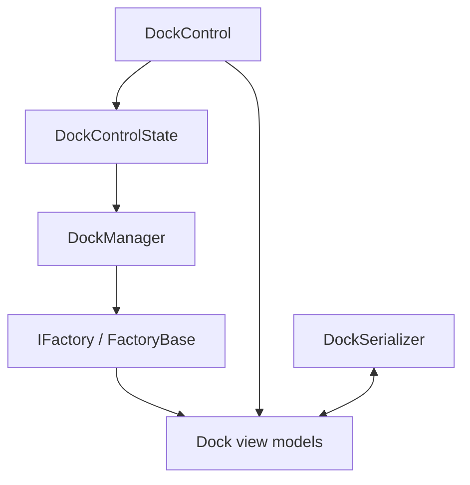

# Dock Architecture Overview

This document provides a high-level look at the major components that make up Dock.
It explains how they cooperate so you can understand the design before reading
the [deep dive](dock-deep-dive.md).

## Major components

- **DockControl** – Avalonia control that hosts the layout and forwards
  pointer input to the docking pipeline.
- **DockManager** – Implements the algorithms that move, swap or split
  dockables during drag operations. It uses `DockManagerOptions` such as
  `PreventSizeConflicts` to avoid docking tools with incompatible fixed sizes.
- **DockControlState** – Tracks pointer interactions and validates potential
  drop targets using `DockManager`.
- **Factories** – Build and initialize dock view models. They expose
  commands for runtime operations such as adding or closing documents.
- **DockSerializer** – Loads and saves layouts to disk so user changes can
  be persisted across sessions.

## Interaction overview

1. `DockControl` displays the layout created by the factory.
2. Pointer events are processed by `DockControlState` which consults
   `DockManager` to validate docking actions.
3. `DockManager` modifies the view models by invoking factory methods.
4. `DockSerializer` can load or save the view models to JSON files.

Customising any of these pieces lets you extend Dock with application specific
behaviour. For an in-depth walkthrough see the [deep dive](dock-deep-dive.md).

