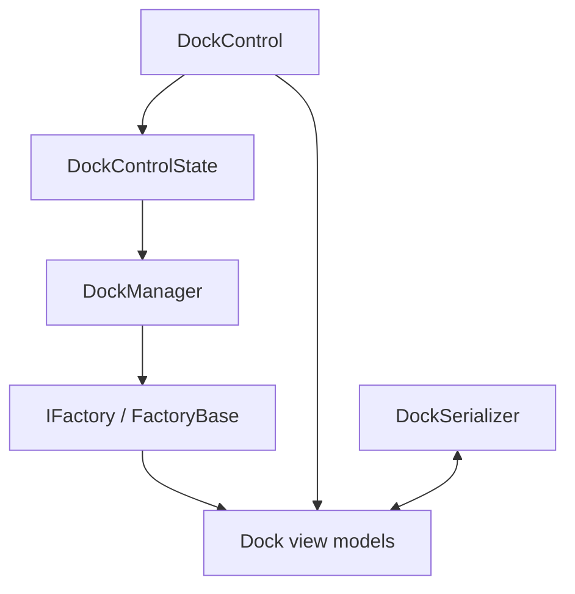

# Dock Architecture Overview

This document provides a high-level look at the major components that make up Dock.
It explains how they cooperate so you can understand the design before reading
the [deep dive](dock-deep-dive.md).

## Major components

- **DockControl** – Avalonia control that hosts the layout and forwards
  pointer input to the docking pipeline.
- **DockManager** – Implements the algorithms that move, swap or split
  dockables during drag operations. It exposes a `PreventSizeConflicts`
  property that stops docking tools together when their fixed sizes clash.
- **DockControlState** – Tracks pointer interactions and validates potential
  drop targets using `DockManager`.
- **Factories** – Build and initialize dock view models. They expose
  commands for runtime operations such as adding or closing documents.
- **DockSerializer** – Loads and saves layouts to disk so user changes can
  be persisted across sessions.

## Interaction overview



1. `DockControl` displays the layout created by the factory.
2. Pointer events are processed by `DockControlState` which consults
   `DockManager` to validate docking actions.
3. `DockManager` modifies the view models by invoking factory methods.
4. `DockSerializer` can load or save the view models to JSON files.

Customising any of these pieces lets you extend Dock with application specific
behaviour. For an in-depth walkthrough see the [deep dive](dock-deep-dive.md).

## Custom IFactory subclasses

Deriving from `Factory` or `FactoryBase` lets you control how view models are created and modified. Override `CreateLayout` or the various helper methods to inject your own documents and tools.

```csharp
public class MyFactory : Factory
{
    public override IDock CreateLayout()
    {
        var layout = base.CreateLayout();
        // customise the root dock here
        return layout;
    }
}
```

Assign an instance of the subclass to `DockControl.Factory` or register it with your DI container before creating the layout.

## Alternative managers and control state

`DockControl` relies on `DockManager` and `DockControlState` to validate drag operations. You can replace either class with your own implementation when custom behaviour is required.

```csharp
public class MyDockManager : DockManager
{
    public override bool ValidateTool(ITool sourceTool, IDockable target, DragAction action, DockOperation operation, bool execute)
    {
        if (operation == DockOperation.Window)
            return false;
        return base.ValidateTool(sourceTool, target, action, operation, execute);
    }
}
```

Create the control with the custom classes:

```csharp
var dockControl = new DockControl
{
    DockManager = new MyDockManager(),
    DockControlState = new DockControlState()
};
```

Use a custom `DockControlState` in a similar fashion if you need to intercept pointer events or change the validation workflow.
