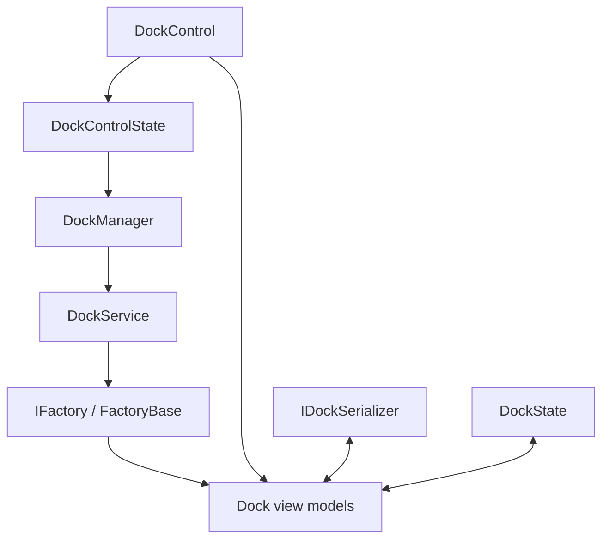

# Dock Architecture Overview

This document provides a high-level look at the major components that make up Dock.
It explains how they cooperate so you can understand the design before reading
the [deep dive](dock-deep-dive.md).

## Major components

- **DockControl** – Avalonia control that hosts the layout and forwards
  pointer input to the docking pipeline.
- **DockManager** – Implements the algorithms that move, swap or split
  dockables during drag operations. It exposes a `PreventSizeConflicts`
  property that stops docking tools together when their fixed sizes clash.
  It also enforces docking group restrictions to control which dockables
  can be docked together.
- **DockService** – Performs the actual move/split/swap operations on docks and
  dockables and calls into the factory to update view models.
- **DockControlState** – Tracks pointer interactions and validates potential
  drop targets using `DockManager`.
- **Factories** – Build and initialize dock view models. They expose
  commands for runtime operations such as adding or closing documents.
- **DockState** – Captures document/tool content and templates that are not
  serialized with the layout so they can be restored after loading.
- **IDockSerializer** – Loads and saves layouts to disk so user changes can
  be persisted across sessions.

## Interaction overview

1. `DockControl` displays the layout created by the factory.
2. Pointer events are processed by `DockControlState` which consults
   `DockManager` to validate docking actions.
3. `DockManager` delegates to `DockService`, which calls factory methods to
   update the view models.
4. `IDockSerializer` loads or saves the layout model, while `DockState` captures
   non-serialized content and templates so they can be restored after loading.

Customising any of these pieces lets you extend Dock with application specific
behavior. For an in-depth walkthrough see the [deep dive](dock-deep-dive.md).
